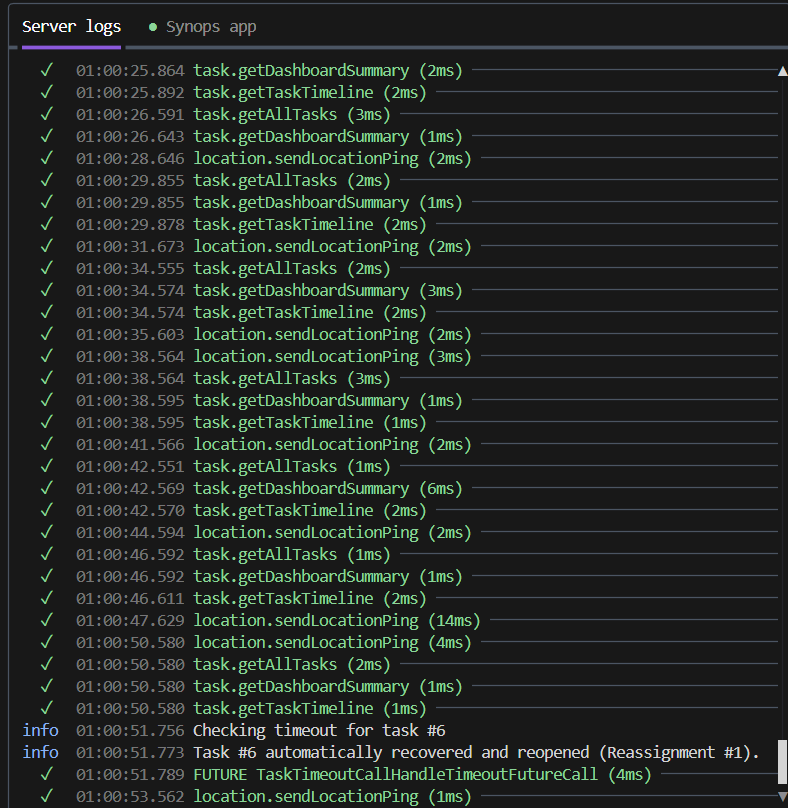
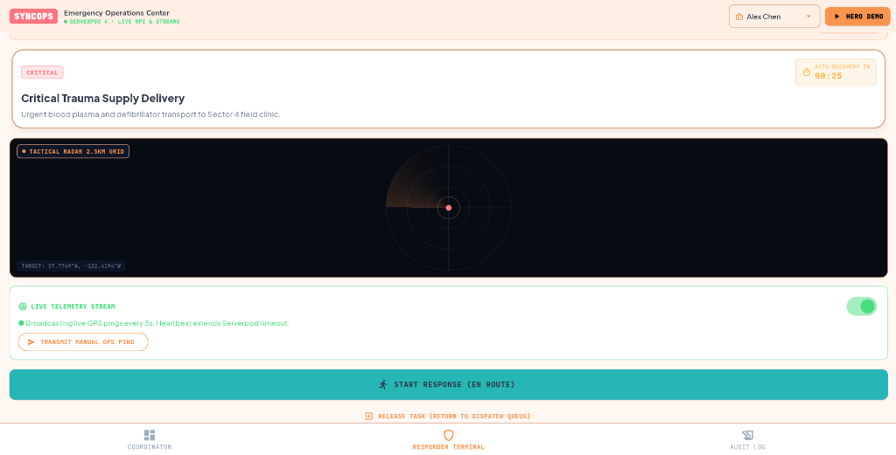
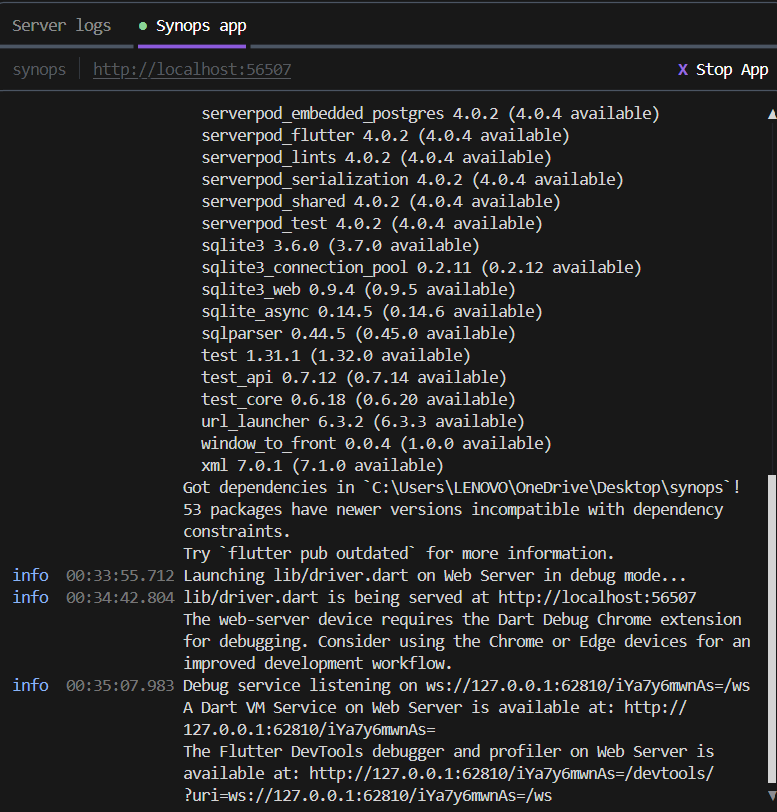
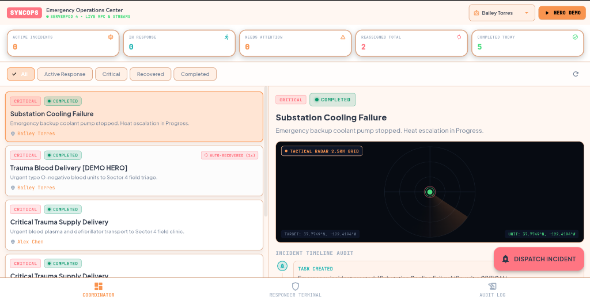
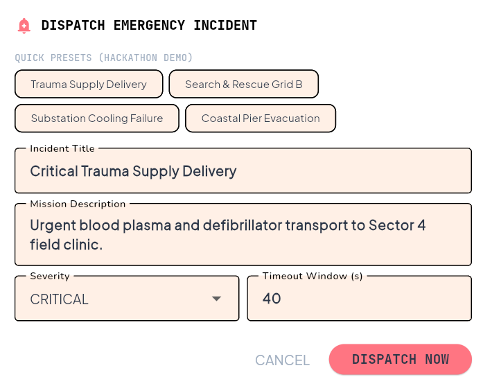
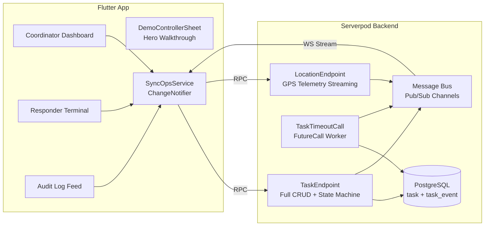
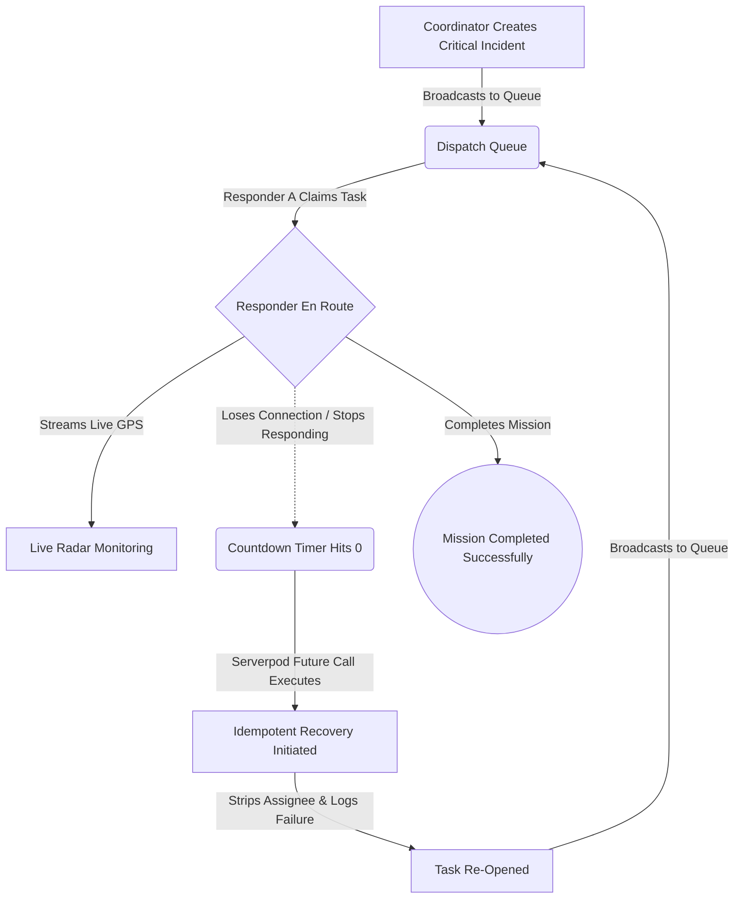
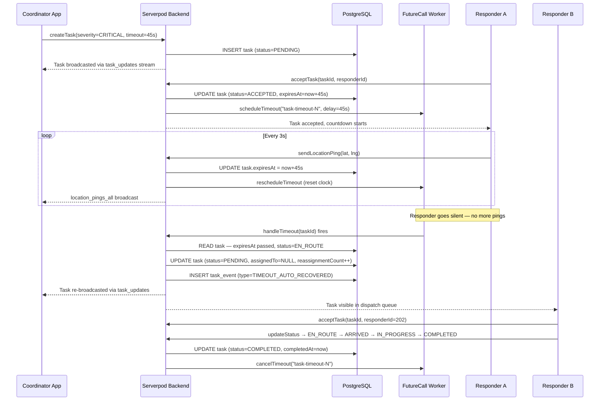

# SyncOps — Real-Time Emergency Task Coordination Platform

[](https://serverpod.dev)
[](https://flutter.dev)
[](https://dart.dev)
[](https://www.postgresql.org)

> **"No emergency task silently disappears when a responder goes offline."**

SyncOps is a state-of-the-art **Emergency Dispatch and Automated Recovery Platform** engineered for high-stakes field response operations. Built with Serverpod and Flutter, SyncOps eliminates the most dangerous failure mode in emergency management: **the silent abandonment gap**—when a field responder claims a critical mission but goes radio-silent due to equipment failure or danger.

---

## 📸 Platform Previews

### 1. Coordinator Dashboard — Emergency Operations Center

*The main command center: Real-time KPI metrics (Active Incidents, In Response, Needs Attention, Reassigned, Completed), live incident feed with severity badges, and a tactical GPS radar monitor for tracking responders in the field.*

---

### 2. Dispatch Emergency Incident

*Dispatchers can instantly load pre-set hackathon demo scenarios (Trauma Supply Delivery, Search & Rescue, Substation Cooling Failure) or create custom incidents with custom Severity and Timeout Window.*

---

### 3. Field Responder Terminal

*The field responder's one-touch interface — showing the live tactical radar, auto-recovery countdown timer, and live GPS telemetry stream. The responder can start their response, transmit GPS pings, and progress through the mission.*

---

### 4. Live Server Logs — Auto-Recovery in Action

*Real Serverpod server logs showing GPS pings arriving every 2-3 seconds, the `TaskTimeoutCall` Future Call firing, and the critical log line: **"Task #6 automatically recovered and reopened (Reassignment #1)."** — the heart of SyncOps.*

---

### 5. Synops App Runtime Logs

*The Serverpod development console showing the Flutter app successfully launched on the web server, with the Dart DevTools debugger and Flutter profiler available for deep inspection.*

---

## ⚡ Key Architectural Highlights

| Layer | Technology | Role |
|-------|-----------|------|
| **Frontend** | Flutter (Web/Mobile) | Coordinator Dashboard, Responder Terminal, Hero Demo |
| **RPC Transport** | Serverpod 4 typed endpoints | Type-safe client-server calls with auto-generated client |
| **Real-Time Events** | Serverpod WebSocket Streams | `task_updates`, `task_events_*`, `location_pings_*` channels |
| **Auto-Recovery Engine** | Serverpod `FutureCall` | Scheduled background timeout verification & re-queue |
| **Persistence** | PostgreSQL + Serverpod ORM | Immutable `task_event` audit trail, task state |
| **Concurrency Guard** | Atomic DB read-then-write | Prevents two responders claiming the same task |

### System Component Diagram



---

## 🔄 The SyncOps Auto-Recovery Workflow

### High-Level Flow



### Detailed Sequence — Auto-Recovery in Action



---

## 🚀 Running the Project Locally

### Prerequisites
- [Flutter SDK](https://flutter.dev) (v3.44+)
- [Dart SDK](https://dart.dev) (v3.12+)
- [Serverpod CLI](https://serverpod.dev) (v4.0.2): `dart pub global activate serverpod_cli 4.0.2`

### 1. Launch the Stack
Run from the workspace root:
```bash
serverpod start
```
- Bootstraps the embedded PostgreSQL database on port `8090`.
- API server listens on `http://localhost:8085`.
- Automatically watches file changes, runs code generation, and hot-reloads the Flutter client.

### 2. View the App
The Flutter web app launches automatically in the browser. If it doesn't, check your terminal for the local port (e.g., `http://localhost:56507`).

### 3. Run the Automated Tests

**Backend Integration Tests (Serverpod + Embedded PostgreSQL)**:
```bash
cd synops_server
dart test
```

**Frontend Widget Tests**:
```bash
cd synops_flutter
flutter test
```

---

## 📜 License
Developed for the Serverpod Hackathon. Licensed under the Apache License, Version 2.0.
