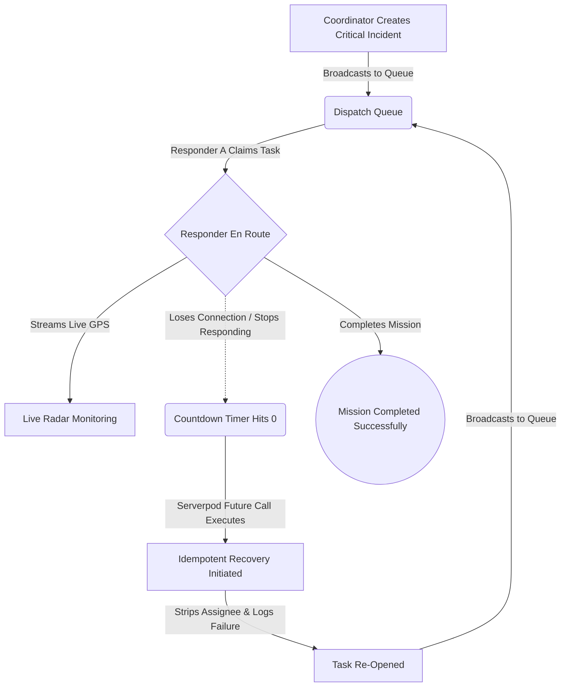

# SyncOps — Real-Time Emergency Task Coordination Platform

[](https://serverpod.dev)
[](https://flutter.dev)
[](https://dart.dev)
[](https://www.postgresql.org)

> **"No emergency task silently disappears when a responder goes offline."**

SyncOps is a state-of-the-art **Emergency Dispatch and Automated Recovery Platform** engineered for high-stakes field response operations. Built with Serverpod and Flutter, SyncOps eliminates the most dangerous failure mode in emergency management: **the silent abandonment gap**—when a field responder claims a critical mission but goes radio-silent due to equipment failure or danger.

With a beautiful, modern **"PawSpa"** light-themed UI, SyncOps provides dispatchers with an incredibly crisp and professional operations center to monitor live telemetry, while background systems handle automated failover.

---

## 📸 Platform Previews

### Coordinator Dashboard & Live Radar
*(Add your screenshot here: `docs/images/coordinator_dashboard.png`)*

*The main command center where dispatchers can view real-time KPIs, active incidents, and live GPS radar of responders in the field.*

### Dispatch Incident & Timeout Window
*(Add your screenshot here: `docs/images/dispatch_modal.png`)*

*Dispatchers can quickly trigger pre-set emergency scenarios or create custom missions with strict Timeout Windows.*

### Responder Terminal
*(Add your screenshot here: `docs/images/responder_terminal.png`)*

*A mobile-optimized, one-touch interface for field workers to claim tasks, report status, and automatically stream telemetry back to base.*

---

## ⚡ Key Architectural Highlights

- **Serverpod 4 Backend**: Full typed RPC endpoints, ORM persistence, and real-time event pub/sub.
- **Automated Failover (`TaskTimeoutCall`)**: Uses Serverpod Future Calls to act as a scheduled background worker. It strictly enforces deadlines and immediately recovers and re-queues tasks if a responder loses connection.
- **Transient Real-Time WebSockets**: High-frequency GPS telemetry is streamed directly over WebSockets (`location_pings_$taskId`) for instant map updates without overwhelming the PostgreSQL database.
- **Atomic Concurrency Checks**: Server-side validation guarantees that two responders can never claim the same emergency task simultaneously.
- **Immutable Audit Trail**: Every status change (Accepted, En Route, Completed, or Recovered) is permanently logged in a `task_event` table for post-incident review.

---

## 🔄 The SyncOps Auto-Recovery Workflow



---

## 🚀 Running the Project Locally

### Prerequisites
- [Flutter SDK](https://flutter.dev) (v3.44+)
- [Dart SDK](https://dart.dev) (v3.12+)
- [Serverpod CLI](https://serverpod.dev) (v4.0.2): `dart pub global activate serverpod_cli 4.0.2`

### 1. Launch the Stack
Run from the workspace root:
```bash
serverpod start
```
- Bootstraps the embedded PostgreSQL database on port `8090`.
- API server listens on `http://localhost:8085`.
- Automatically watches file changes, runs code generation, and hot-reloads the Flutter client.

### 2. View the App
If the Flutter app doesn't automatically open, navigate to:
```
http://localhost:64716
```
*(Check your terminal for the exact local Flutter dev server port).*

### 3. Run the Automated Tests

**Backend Integration Tests (Serverpod + Embedded PostgreSQL)**:
```bash
cd synops_server
dart test
```

**Frontend Widget Tests**:
```bash
cd synops_flutter
flutter test
```

---

## 📜 License
Developed for the Serverpod Hackathon. Licensed under the Apache License, Version 2.0.
